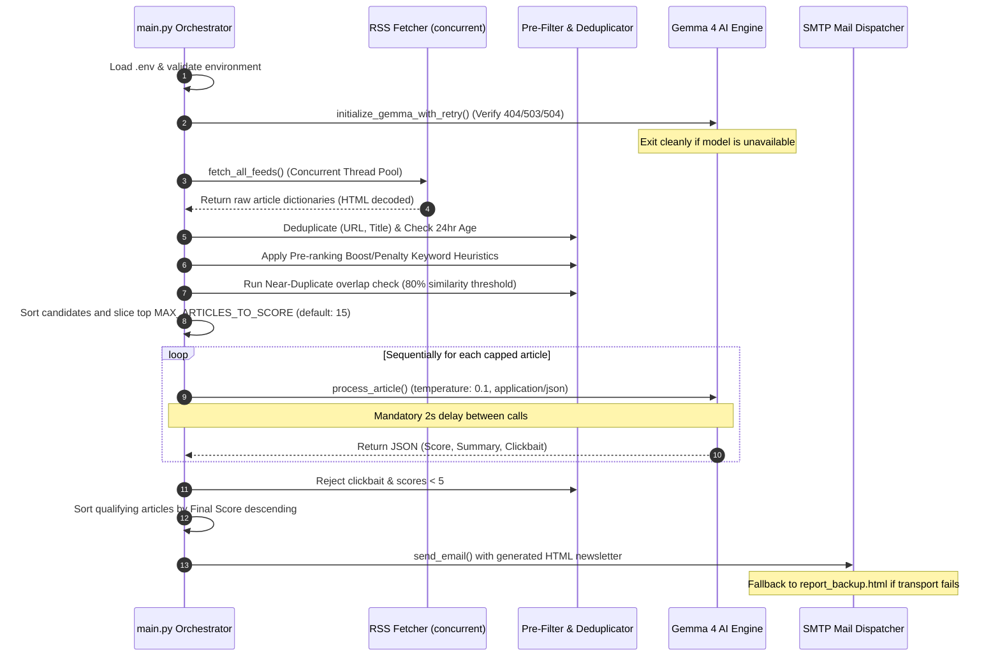

<h1 align="center">🎯 AI Daily News Trend Hunter</h1>

<p align="center">
  <strong>An Automated, Quota-Safe, Intelligent News Ingestion & Curation Pipeline</strong>
</p>

<p align="center">
  <a href="https://github.com/basavarajpatil660/daily-news-hunter/actions"></a>
  <a href="https://ai.google.dev/"></a>
  <a href="https://www.python.org"></a>
  <a href="https://www.instagram.com/b.nick.ai/"></a>
</p>

<hr />

## 📖 Table of Contents
1. [System Overview](#-system-overview)
2. [Workflow Architecture](#-workflow-architecture)
3. [Deep-Dive Technical Features](#-deep-dive-technical-features)
4. [Project Layout](#-project-layout)
5. [Getting Started (Step-by-Step)](#-getting-started-step-by-step)
6. [Gemma 4 Prompts & JSON Schema](#-gemma-4-prompts--json-schema)
7. [Troubleshooting & Quota Safety](#-troubleshooting--quota-safety)
8. [Contributing](#-contributing)
9. [License](#-license)

---

## 🔍 System Overview

**AI Daily News Trend Hunter** is an enterprise-grade news curation agent that scans public RSS feeds, filters out noise, scores article relevance using Google AI Studio's **Gemma 4** (`gemma-4-31b-it`), and delivers beautiful, mobile-friendly newsletters directly to your inbox. 

It is designed with strict **quota safety bounds**, ensuring it never exhausts your API limits while maintaining the highest standard of relevance.

---

## 🌀 Workflow Architecture

Below is the execution sequence for each scheduled run:



---

## ⚡ Deep-Dive Technical Features

### 📡 1. Intelligent Concurrent Fetcher (`services/rss.py`)
Fetches all target RSS feeds (Google News search parameters + top tech publications like TechCrunch, Wired, The Verge) concurrently using Python's `threading` modules.
*   **Timeout & Retries:** 10-second request timeout limit; attempts up to 3 times before skipping to ensure no deadlocks.
*   **Robust Parsing:** Decodes complex HTML entities (e.g. `&#8217;` ➔ `'`) and leverages `python-dateutil` to parse all ISO 8601 offset strings into standard UTC time.

### 🧠 2. Dual-Stage Filter & Sorting (`utils/scoring.py`)
Reduces API costs by running a two-pass relevance checker:
*   **Boost Keywords (+2 pts):** "AI regulation", "cybersecurity breach", "funding round", "acquisition", "developer tools", "platform change", "open source", etc.
*   **Penalty Keywords (-2 pts):** "deals", "rumors", "Fitbit", "UI change", "complaint", "review", "unboxing", "tips and tricks", etc.
*   **Exclusion Filter:** Any article containing a penalty keyword without a boost keyword is immediately dropped in python code prior to AI scoring.
*   **Source Credibility Adjustment:** Final scores receive a `+1` adjustment for verified publishers (BBC, The Hindu, Times of India, Wired, TechCrunch, etc.) or a `-1` penalty for unknown sources.

### 🛡️ 3. Quota Safety Bounds (`utils/retry.py`)
Protects against Google AI Studio rate limits:
*   **Capped Requests:** Never sends more than `MAX_ARTICLES_TO_SCORE` (default: 15) to Gemma 4 per execution.
*   **Mandatory Delay:** Enforces a strict `time.sleep(2)` delay after *every* single API call (both successful and retried).
*   **Smart Retry Wrapper:** Uses exponential backoff (5s, 10s, 20s, 40s, 60s) with error overrides (60s on 429 quota errors, 30s on 503/504/timeout/deadline).

---

## 📁 Project Layout

```text
daily-news-hunter/
├── .github/workflows/
│   └── daily.yml          # GitHub Actions workflow (daily schedule & dispatch)
├── config/
│   ├── __init__.py
│   └── categories.py      # Category definitions, keywords, colors, & URL builders
├── services/
│   ├── __init__.py
│   ├── rss.py             # Concurrent feed parser with python-dateutil
│   ├── gemma.py           # Gemma 4 initialization & scoring execution
│   └── mail.py            # Gmail SMTP transport with backup mechanism
├── utils/
│   ├── __init__.py
│   ├── retry.py           # Exponential backoff & override wrapper
│   ├── scoring.py         # Credibility & pre-rank scoring rules
│   ├── deduplicate.py     # URL, title, & near-duplicate token deduplicator
│   ├── filter.py          # Clickbait, minimum score, and keyword filtering
│   └── format.py          # Human-readable date-times and badge formatters
├── reports/
│   ├── __init__.py
│   └── email_template.py  # Gmail-compliant HTML newsletter generator
├── .env.example           # Local environment configuration template
├── .gitignore             # Git exclusion rules
├── LICENSE                # MIT License
├── requirements.txt       # Hardpinned Python dependencies
└── main.py                # Main pipeline coordinator & environment validator
```

---

## 🛠️ Getting Started (Step-by-Step)

<details>
<summary><b>1. Local Installation & Configuration</b></summary>

### Prerequisites
*   Python 3.11 or higher
*   Google AI Studio API Key ([Get it for free](https://aistudio.google.com/app/apikey))
*   Gmail Sender Account with an [App Password](https://myaccount.google.com/apppasswords)

### Steps

1.  **Clone & Navigate:**
    ```bash
    git clone https://github.com/basavarajpatil660/daily-news-hunter.git
    cd daily-news-hunter
    ```

2.  **Initialize Virtual Environment & Install:**
    ```bash
    python -m venv venv
    source venv/bin/activate  # On Windows use: venv\Scripts\activate
    pip install -r requirements.txt
    ```

3.  **Setup Environment Variables:**
    Create a `.env` file from the example template:
    ```bash
    cp .env.example .env
    ```
    Populate the variables:
    ```env
    GEMINI_API_KEY=AIzaSy...your_google_studio_key
    GMAIL_USER=your_sending_address@gmail.com
    GMAIL_PASS=xxxx xxxx xxxx xxxx  # 16-character App Password
    EMAIL_TO=your_receiving_address@gmail.com
    NEWS_CATEGORIES=AI News,Tech News
    NEWS_REGION=IN
    NEWS_LANGUAGE=en
    TOP_ARTICLES_COUNT=5
    MAX_ARTICLES_TO_SCORE=15
    ```

4.  **Execute the Script:**
    ```bash
    python main.py
    ```
</details>

<details>
<summary><b>2. GitHub Actions Deployment</b></summary>

The workflow is located in `.github/workflows/daily.yml` and is pre-configured to run automatically daily at 6:00 AM IST (00:30 UTC).

To configure this in production:

1.  Go to your repository on GitHub.
2.  Click on **Settings** ➔ **Secrets and variables** ➔ **Actions**.
3.  Click **New repository secret** and add the following 9 secrets:

| Secret Name | Example Value |
| :--- | :--- |
| `GEMINI_API_KEY` | `AIzaSyYourGeminiApiKey` |
| `GMAIL_USER` | `myemail@gmail.com` |
| `GMAIL_PASS` | `abcd efgh ijkl mnop` (Gmail App Password) |
| `EMAIL_TO` | `receiver@domain.com` |
| `NEWS_CATEGORIES` | `AI News,Tech News` |
| `NEWS_REGION` | `IN` |
| `NEWS_LANGUAGE` | `en` |
| `TOP_ARTICLES_COUNT` | `5` |
| `MAX_ARTICLES_TO_SCORE`| `15` |

4.  **Run Manually:** Navigate to the **Actions** tab, click **Daily News Hunter** from the left list, click the **Run workflow** dropdown, and click **Run workflow** to test immediately.
</details>

---

## 🧠 Gemma 4 Prompts & JSON Schema

Every selected article is processed with the following strict temperature configuration (`0.1`) and prompt:

```text
You are a news relevance scorer.
The user wants news about: {categories}
The user region is: {region}

Article title: {title}
Article description: {description}
Article source: {source}

Your tasks:
1. Rate relevance from 0 to 10.
   10 means perfectly matches user interest.
   0 means completely irrelevant.
   Only give scores of 7 or above for genuinely
   important, substantial news stories.
   Do not give high scores to minor app updates,
   rumors, opinion pieces, or consumer complaints.
2. Write a 2 sentence summary in simple English.
3. Write an importance_reason explaining why the story matters (3-7 words).
4. Decide if this is clickbait.
   Clickbait means: shocking title with no real news,
   misleading headline, or pure motivation/opinion.

Additionally, you MUST reject (rate relevance score 0) any articles about:
- Celebrity gossip
- Bollywood entertainment unless user chose it
- Sports scores unless user chose it
- Astrology or horoscopes
- Motivational content with no real news value
- Crypto pump or investment schemes
- Pure opinion pieces

IMPORTANT: Respond ONLY in valid JSON format.
No extra text before or after.
No markdown formatting.
No code blocks.
Start response with { and end with }

{
  "score": 8,
  "summary": "First sentence here. Second sentence here.",
  "importance_reason": "Brief insight phrase",
  "clickbait": false
}
```

---

## 🛡️ Troubleshooting & Quota Safety

### 🔴 Model Returns 404 (Model Unavailable)
*   **Cause:** The target model `gemma-4-31b-it` is temporarily decommissioned, out of service, or not supported by your API key region.
*   **Solution:** The script checks this during `initialize_gemma_with_retry()` at startup. It will gracefully log:
    ```text
    Gemma 4 (gemma-4-31b-it) is not available right now.
    Will retry at next scheduled run.
    ```
    It then exits cleanly with exit code `0` to prevent unnecessary job failure alerts.

### 🟡 429 Rate Limit Exceeded
*   **Cause:** Too many calls are sent in a short window.
*   **Solution:** The script sequentially processes scoring requests. On hitting a `429` error, the retry wrapper overrides wait time to `60` seconds and sleeps before attempting again.

### ✉️ Gmail Authentication Error
*   **Cause:** App Passwords are disabled, or the user credentials in `.env` are invalid.
*   **Solution:** Check the application logs. If email delivery fails, the orchestrator will write the fully generated briefing locally into `report_backup.html` in the project root so no scanned news is lost.

---

## 🤝 Contributing

Contributions make the open-source community an amazing place to learn, inspire, and create. Any contributions you make are **greatly appreciated**. 

Please read our [CONTRIBUTING.md](CONTRIBUTING.md) for details on our code of conduct, the development environment setup, and the process for submitting pull requests.

---

## 🛡️ License

Distributed under the MIT License. See [LICENSE](LICENSE) for more details.

---

<p align="center">
  Powered by <a href="https://www.instagram.com/b.nick.ai/">@b.nick.ai</a>
</p>