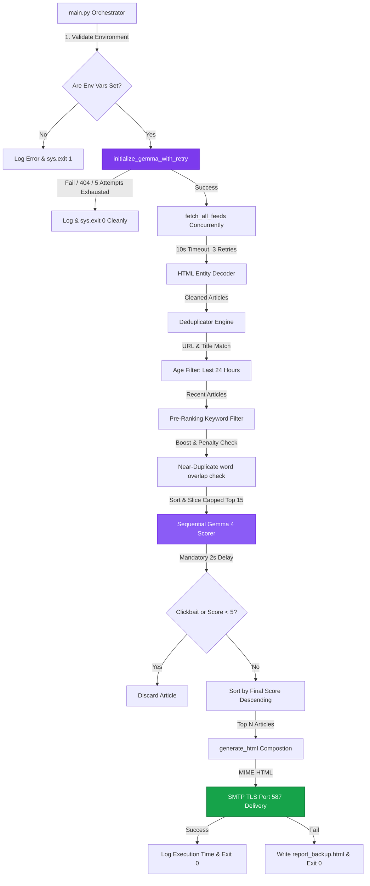

<h1 align="center">🎯 AI Daily News Trend Hunter</h1>

<p align="center">
  <strong>An Automated, Quota-Safe, Production-Ready News Ingestion, AI Curation & Email Delivery Agent</strong>
</p>

<p align="center">
  <a href="https://github.com/basavarajpatil660/daily-news-hunter/actions"></a>
  <a href="https://ai.google.dev/"></a>
  <a href="https://www.python.org"></a>
  <a href="https://www.instagram.com/b.nick.ai/"></a>
  <a href="LICENSE"></a>
</p>

<hr />

## 📖 Table of Contents
*   [1. System Architecture](#-1-system-architecture)
*   [2. Deep-Dive Feature Set](#-2-deep-dive-feature-set)
*   [3. Directory Structure & Symbol Registry](#-3-directory-structure--symbol-registry)
*   [4. Advanced Scoring & Pre-Ranking Mathematics](#-4-advanced-scoring--pre-ranking-mathematics)
*   [5. Quota Protection & API Resilience Layer](#-5-quota-protection--api-resilience-layer)
*   [6. Gemma 4 Prompt Design & JSON Validator](#-6-gemma-4-prompt-design--json-validator)
*   [7. Setup & Local Sandbox Installation](#-7-setup--local-sandbox-installation)
*   [8. Production CI/CD Setup (GitHub Actions)](#-8-production-cicd-setup-github-actions)
*   [9. Security Guarantee: Safe Public Repositories](#-9-security-guarantee-safe-public-repositories)
*   [10. HTML Email Design System](#-10-html-email-design-system)
*   [11. FAQ & Troubleshooting Guide](#-11-faq--troubleshooting-guide)
*   [12. Contributing & License](#-12-contributing--license)

---

## 🌀 1. System Architecture

The following state machine represents the pipeline orchestration, running sequentially with built-in quota safety delays:



---

## ⚡ 2. Deep-Dive Feature Set

| Feature | Implementation Module | Technical Benefit |
| :--- | :--- | :--- |
| **Concurrent Scraper** | [`services/rss.py`](file:///c:/Users/basav/New%20folder/daily-news-hunter/services/rss.py) | Scrapes multiple feeds concurrently using a daemon thread pool to maximize throughput. |
| **Robust Date Parsing** | [`services/rss.py`](file:///c:/Users/basav/New%20folder/daily-news-hunter/services/rss.py) | Leverages `python-dateutil` to handle various RFC 822 and ISO 8601 offset strings into standard UTC time. |
| **Quota Safety Valve** | [`main.py`](file:///c:/Users/basav/New%20folder/daily-news-hunter/main.py) | Caps articles submitted to Gemma 4 at a hard limit (default: 15) using priority pre-ranking. |
| **Resilient Retries** | [`utils/retry.py`](file:///c:/Users/basav/New%20folder/daily-news-hunter/utils/retry.py) | Exponential backoff retry logic (5s to 60s) with error overrides for 429, 503/504, and 500 exceptions. |
| **Smart Deduplication** | [`utils/deduplicate.py`](file:///c:/Users/basav/New%20folder/daily-news-hunter/utils/deduplicate.py) | Removes exact URLs, titles, and near-duplicate titles sharing $\ge 80\%$ word tokens. |
| **HTML Newsletter** | [`reports/email_template.py`](file:///c:/Users/basav/New%20folder/daily-news-hunter/reports/email_template.py) | Renders mobile-responsive single-column newsletters styled with inline CSS, visual badges, and branding. |
| **Reliable Failover** | [`services/mail.py`](file:///c:/Users/basav/New%20folder/daily-news-hunter/services/mail.py) | Automatically dumps the generated newsletter to `report_backup.html` in the root folder if SMTP fails. |

---

## 📂 3. Directory Structure & Symbol Registry

The codebase is structured modularly following strict object-oriented and separation-of-concerns paradigms:

*   **[`main.py`](file:///c:/Users/basav/New%20folder/daily-news-hunter/main.py)**: The central orchestration module. Validates environment configurations, triggers Gemma startup handshakes, deduplicates articles, sorts priorities, and manages SMTP mail execution.
*   **[`config/categories.py`](file:///c:/Users/basav/New%20folder/daily-news-hunter/config/categories.py)**:
    *   `CATEGORIES`: Dictionary containing keywords, branding hex colors, and custom RSS feeds.
    *   `get_google_news_rss(keyword, region, language)`: Generates regionalized Google search RSS query URLs.
*   **[`services/rss.py`](file:///c:/Users/basav/New%20folder/daily-news-hunter/services/rss.py)**:
    *   `parse_date(date_string)`: Robust time parsing using `dateutil.parser.parse`.
    *   `fetch_feed(url, results, category, lock)`: Scrapes individual feeds with a 10s timeout, up to 3 times, and decodes HTML entities.
    *   `fetch_all_feeds(feeds_with_categories)`: Spawns and manages a concurrent thread pool.
*   **[`services/gemma.py`](file:///c:/Users/basav/New%20folder/daily-news-hunter/services/gemma.py)**:
    *   `initialize_gemma_with_retry()`: Establishes a startup verification check to ensure model availability.
    *   `process_article(article, categories, region)`: Generates prompts, executes calls via retry wrappers, and enriches candidate objects.
*   **[`services/mail.py`](file:///c:/Users/basav/New%20folder/daily-news-hunter/services/mail.py)**:
    *   `send_email(subject, html_content, to_email, gmail_user, gmail_pass)`: Dispatches reports via SMTP Port 587 (TLS).
*   **[`utils/`](file:///c:/Users/basav/New%20folder/daily-news-hunter/utils/)**:
    *   [`retry.py`](file:///c:/Users/basav/New%20folder/daily-news-hunter/utils/retry.py): Contains `call_with_retry(fn, label)` handling exponential backoffs.
    *   [`scoring.py`](file:///c:/Users/basav/New%20folder/daily-news-hunter/utils/scoring.py): Contains `pre_rank_article(article)` and final adjusted score logic.
    *   [`deduplicate.py`](file:///c:/Users/basav/New%20folder/daily-news-hunter/utils/deduplicate.py): Computes word overlap index and handles deduplication.
    *   [`filter.py`](file:///c:/Users/basav/New%20folder/daily-news-hunter/utils/filter.py): Age checking, clickbait removal, and penalty keyword exclusion filters.
    *   [`format.py`](file:///c:/Users/basav/New%20folder/daily-news-hunter/utils/format.py): Formats relative time strings ("X hours ago") and category badge mappings.

---

## 📈 4. Advanced Scoring & Pre-Ranking Mathematics

To maximize quality while reducing LLM cost overheads, the application employs a two-tier scoring system.

### Tier 1: Local Pre-Ranking Heuristics
Before calling the AI model, each article's content is evaluated locally:
$$\text{Pre-Rank Score} = \text{Credibility Modifier} + \sum \text{Boosts} - \sum \text{Penalties}$$

*   **Boost Keywords (+2 points):** `"AI regulation"`, `"cybersecurity breach"`, `"funding round"`, `"acquisition"`, `"developer tools"`, `"api release"`, `"open source"`, `"platform change"`, `"research paper"`, `"government policy"`, `"data privacy law"`.
*   **Penalty Keywords (-2 points):** `"deals"`, `"rumors"`, `"fitbit"`, `"ui change"`, `"complaint"`, `"review"`, `"unboxing"`, `"comparison"`, `"best of list"`, `"top 10"`, `"how to"`, `"tips and tricks"`.
*   **Keyword Exclusion:** Articles containing any penalty keywords are immediately skipped, unless they also contain at least one boost keyword.

### Tier 2: Final Scoring Adjustments
After Gemma 4 scores an article, we apply a credibility modifier:
$$\text{Final Score} = \text{Gemma 4 Score} \pm \text{Credibility Modifier}$$

*   **Reputable Source Boost (+1 point):** Given to trusted publishers like *TechCrunch*, *The Verge*, *Wired*, *Ars Technica*, *MIT Tech Review*, *BBC*, *Reuters*, *AP News*, *The Hindu*, *Times of India*, *Economic Times*, *NDTV*, *India Today*, *Hindustan Times*, *Bloomberg*, *Forbes*, *VentureBeat*, *ZDNet*, *CNET*, or *Engadget*.
*   **Unknown Source Penalty (-1 point):** Subtracted from blogs, feeds, or unknown portals.

---

## 🛡️ 5. Quota Protection & API Resilience Layer

Google AI Studio enforces rate limits (RPM and RPD). The utilities layer protects your limits with:

1.  **Gemma Startup Handshake:** At startup, `initialize_gemma_with_retry()` sends a mock payload. If it encounters a `404` (model decommissioned or unavailable), it logs clearly and exits cleanly (`sys.exit(0)`) without raising alerts.
2.  **Sequential Processing:** All AI scoring calls are queued sequentially. We never run parallel scoring threads.
3.  **Mandatory Sleep Gap:** A hard-coded `time.sleep(2)` delay is enforced after every API request (even on success) to prevent rate-limit spikes.
4.  **Error Overrides:** If an exception occurs, the retry wrapper reads the exception string and adjusts wait times before retrying:

```text
Error Type               Override Behavior
─────────────────────────────────────────────────────────────────
"429" / "quota" / "rate" ➔ Wait a minimum of 60 seconds.
"503" / "504" / "timeout"➔ Wait a minimum of 30 seconds.
"500"                    ➔ Wait a minimum of 15 seconds.
"404" (Not Found)        ➔ Exit immediately (do not retry).
```

---

## 🧠 6. Gemma 4 Prompt Design & JSON Validator

Every article is scored using a highly structured prompt configuration. By enforcing `response_mime_type: "application/json"`, we guarantee clean structural outputs.

### Prompts
```text
You are a news relevance scorer.
The user wants news about: {categories}
The user region is: {region}

Article title: {title}
Article description: {description}
Article source: {source}

Your tasks:
1. Rate relevance from 0 to 10.
   10 means perfectly matches user interest.
   0 means completely irrelevant.
   Only give scores of 7 or above for genuinely important, substantial news stories.
   Do not give high scores to minor app updates, rumors, opinion pieces, or consumer complaints.
2. Write a 2 sentence summary in simple English.
3. Write an importance_reason explaining why the story matters (3-7 words).
4. Decide if this is clickbait.
   Clickbait means: shocking title with no real news, misleading headline, or pure motivation/opinion.

Additionally, you MUST reject (rate relevance score 0) any articles about:
- Celebrity gossip
- Bollywood entertainment unless user chose it
- Sports scores unless user chose it
- Astrology or horoscopes
- Motivational content with no real news value
- Crypto pump or investment schemes
- Pure opinion pieces

IMPORTANT: Respond ONLY in valid JSON format.
No extra text before or after.
No markdown formatting.
No code blocks.
Start response with { and end with }

{
  "score": 8,
  "summary": "First sentence here. Second sentence here.",
  "importance_reason": "Brief insight phrase",
  "clickbait": false
}
```

### Response Cleaning & Validation
*   **JSON Extractor:** Extracts target JSON objects using regex:
    ```python
    text = re.sub(r'```(?:json)?\s*', '', text)  # Strips markdown block formatting
    ```
*   **Response Validator:** Verifies structure, score ranges ($0 \le \text{score} \le 10$), summary lengths, and parses stringified clickbait booleans. If validation fails, the attempt is marked as failed, triggering the retry cycle.

---

## 🛠️ 7. Setup & Local Sandbox Installation

<details>
<summary><b>💻 Local Setup (Virtual Environment)</b></summary>

### Prerequisites
*   Python 3.11 or higher
*   Google AI Studio API Key ([Get it for free](https://aistudio.google.com/app/apikey))
*   Gmail Sender Account with an [App Password](https://myaccount.google.com/apppasswords)

### Steps

1.  **Clone the Repo:**
    ```bash
    git clone https://github.com/basavarajpatil660/daily-news-hunter.git
    cd daily-news-hunter
    ```

2.  **Initialize Virtual Environment:**
    ```bash
    python -m venv venv
    source venv/bin/activate  # Windows: venv\Scripts\activate
    ```

3.  **Install Requirements:**
    ```bash
    pip install -r requirements.txt
    ```

4.  **Configure Environment Variables:**
    Create a local `.env` file from the template:
    ```bash
    cp .env.example .env
    ```
    Populate the variables:
    ```env
    GEMINI_API_KEY=AIzaSy...YourKey
    GMAIL_USER=sender@gmail.com
    GMAIL_PASS=abcd efgh ijkl mnop  # 16-character App Password
    EMAIL_TO=recipient@gmail.com
    NEWS_CATEGORIES=AI News,Tech News
    NEWS_REGION=IN
    NEWS_LANGUAGE=en
    TOP_ARTICLES_COUNT=5
    MAX_ARTICLES_TO_SCORE=15
    ```

5.  **Run:**
    ```bash
    python main.py
    ```
</details>

---

## ☁️ 8. Production CI/CD Setup (GitHub Actions)

The scheduled pipeline is configured in `.github/workflows/daily.yml` and is pre-configured to run automatically daily at 6:00 AM IST (00:30 UTC) with a workflow dispatch fallback for manual executions.

To set up production runner automation:

1.  Go to your repository on GitHub.
2.  Click on **Settings** ➔ **Secrets and variables** ➔ **Actions**.
3.  Click **New repository secret** and add the following 9 secrets:

| Secret Name | Example / Target Value |
| :--- | :--- |
| `GEMINI_API_KEY` | `AIzaSy...YourGeminiApiKey` |
| `GMAIL_USER` | `yoursender@gmail.com` |
| `GMAIL_PASS` | `abcd efgh ijkl mnop` (16-char App Password) |
| `EMAIL_TO` | `yourrecipient@email.com` |
| `NEWS_CATEGORIES` | `AI News,Tech News` |
| `NEWS_REGION` | `IN` (or `US`, `Global`) |
| `NEWS_LANGUAGE` | `en` (or `hi`) |
| `TOP_ARTICLES_COUNT` | `5` |
| `MAX_ARTICLES_TO_SCORE`| `15` |

4.  **Run Manually:** Navigate to the **Actions** tab, select **Daily News Hunter**, click the **Run workflow** dropdown, and click **Run workflow** to test immediately.

---

## 🛡️ 9. Security Guarantee: Safe Public Repositories

**Yes! It is 100% safe to make this repository public.** Your personal API keys and credentials will **never** be leaked because:
1.  **`.env` Exclusion:** The local `.env` configuration file is explicitly listed in `.gitignore`. It remains private on your local machine and will never be committed to Git.
2.  **Encrypted Secrets Vault:** The GitHub Actions workflow relies strictly on encrypted repository secrets. These values are encrypted by GitHub and cannot be read by public visitors or printed to workflow logs.
3.  **Clean Templates:** Only `.env.example` is pushed to GitHub, containing empty templates and placeholders.

---

## 🎨 10. HTML Email Design System

Briefing digests are compiled into a highly polished, responsive email layout designed for maximum rendering compatibility across Gmail (Web and Mobile apps):

*   **Responsive Single-Column Layout:** Features a fixed maximum width of `600px` centered on the viewport.
*   **Inline CSS Styling:** Uses only inline styles. Avoids JavaScript, classes, or external style declarations that are frequently stripped by email clients.
*   **Visual Highlights:** Includes custom badges for categories and an "Important" badge for final adjusted scores $\ge 9.0$.
*   **Branding & Typography:** Clean sans-serif typography, customizable tag branding, and a footer linked to the `@b.nick.ai` Instagram page.

### Topic Color Palette Badge Mapping:
*   💜 **AI News:** `#7c3aed`
*   💙 **Tech News:** `#2563eb`
*   💙 **AI App Building:** `#4338ca`
*   ❤️ **Cybersecurity:** `#dc2626`
*   🧡 **Startup and Entrepreneur:** `#ea580c`
*   💚 **Science and Research:** `#16a34a`
*   🖤 **Space and Astronomy:** `#1e3a5f`
*   💛 **Finance and Economy:** `#ca8a04`
*   💚 **Health and Medical Tech:** `#0d9488`
*   🖤 **Custom / Other Topics:** `#4b5563`

---

## ❓ 11. FAQ & Troubleshooting Guide

### Q1: The Actions run failed with "Gemma 4 is not available"
*   **Cause:** The `gemma-4-31b-it` model is temporarily decommissioned, experiencing service failures at Google, or unavailable to your API key.
*   **Solution:** The script handles this gracefully at startup. It will exit with code `0` cleanly so you do not receive false-alarm repository alerts. It will automatically check again during the next scheduled run.

### Q2: SMTP Authentication fails or returns connection timeout
*   **Cause:** You are using your normal account password instead of a 16-character App Password, or Gmail App Passwords have been disabled on your account.
*   **Solution:** Enable 2-Step Verification on Gmail and generate a new App Password under Settings ➔ Security ➔ App Passwords.

### Q3: How do I change the schedule?
*   **Cause:** The workflow runs daily at 6:00 AM IST.
*   **Solution:** Edit `.github/workflows/daily.yml` and modify the POSIX cron expression:
    ```yaml
    on:
      schedule:
        - cron: "30 0 * * *"  # Run once daily (00:30 UTC = 06:00 IST)
    ```

---

## 🤝 12. Contributing & License

### Contributing
We welcome contributions! Please review the [CONTRIBUTING.md](CONTRIBUTING.md) file for setup steps, branching guidelines, and pull request procedures.

### License
This project is licensed under the MIT License - see the [LICENSE](LICENSE) file for details.

---

<p align="center">
  Powered by <a href="https://www.instagram.com/b.nick.ai/">@b.nick.ai</a>
</p>