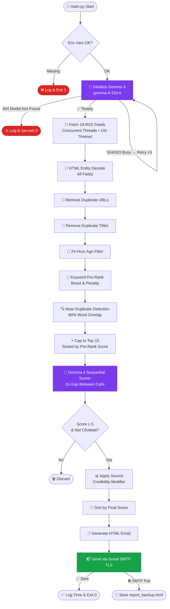

<div align="center">


<br/>

[](https://github.com/basavarajpatil660/daily-news-hunter/actions)
[](https://ai.google.dev/)
[](https://www.python.org)
[](#)
[](https://www.instagram.com/b.nick.ai/)
[](LICENSE)

<br/>

> **Wake up to a curated AI-scored news briefing in your inbox — every single morning. Automatically. For free.**

<br/>

[🚀 Quick Start](#-quick-start-5-minutes) · [⚙️ How It Works](#%EF%B8%8F-how-it-works) · [📧 Email Preview](#-email-output) · [☁️ Deploy to GitHub Actions](#%EF%B8%8F-deploy-to-github-actions) · [❓ FAQ](#-faq)

</div>

---

## 🧠 What Is This?

**AI Daily News Trend Hunter** is a fully automated Python agent that:

1. **Fetches** hundreds of real articles from top RSS feeds every morning
2. **Filters** them using keyword pre-ranking — no AI cost wasted on junk
3. **Scores** the top 15 with **Gemma 4** (`gemma-4-31b-it`) for relevance, quality, and clickbait detection
4. **Delivers** a clean, beautifully formatted HTML email report to your inbox

Zero subscriptions. Zero paid APIs. Zero manual effort after setup.

It runs on **GitHub Actions** — meaning your computer doesn't need to be on. Ever.

---

## ✨ Feature Highlights

```
┌─────────────────────────────────────────────────────────────────────┐
│                                                                     │
│   📡  Concurrent RSS scraping from 19+ top news sources            │
│   🤖  Gemma 4 AI scoring — relevance, summary, insight, clickbait  │
│   🛡️  Quota-safe: max 15 AI calls per run with 2s rate protection  │
│   🔁  Exponential backoff retry (5 attempts, up to 60s wait)       │
│   🧹  3-stage deduplication: URL → Title → 80% word overlap        │
│   📅  python-dateutil for bulletproof date parsing                 │
│   📬  Beautiful single-column HTML email — Gmail + mobile ready    │
│   💾  Auto-saves report_backup.html if SMTP fails                  │
│   ⏰  Runs daily at 6:00 AM IST via GitHub Actions — free forever  │
│   🔒  Zero secrets committed — all keys stored in GitHub Vault     │
│                                                                     │
└─────────────────────────────────────────────────────────────────────┘
```

---

## ⚙️ How It Works



---

## 📧 Email Output

Every morning you receive a clean briefing like this:

```
┌──────────────────────────────────────────────────────┐
│  🗞️  Daily AI & Tech News — May 28, 2026             │
│  Scored by Gemma 4 • 15 articles reviewed            │
├──────────────────────────────────────────────────────┤
│                                                      │
│  [IMPORTANT] [AI News]                               │
│  Illinois Lawmakers Just Passed America's            │
│  Strongest AI Safety Bill                            │
│  WIRED · 2 hours ago                                 │
│                                                      │
│  Summary: Illinois has enacted landmark AI           │
│  safety legislation requiring transparency from      │
│  developers of high-risk AI systems.                 │
│                                                      │
│  💡 Why it matters: First strong US state AI law     │
│                                                      │
│  [Read Full Article →]                               │
├──────────────────────────────────────────────────────┤
│  [Tech News]                                         │
│  CrowdStrike and Google Take Down Botnet             │
│  Used to Target Open Source Developers               │
│  TechCrunch · 5 hours ago                            │
│  ...                                                 │
└──────────────────────────────────────────────────────┘
```

---

## 📊 Scoring System

Two-tier scoring ensures only the best articles reach your inbox.

### Tier 1 — Local Pre-Ranking (No AI Cost)

$$\text{Pre-Rank} = \text{Source Credibility} + \sum\text{Boosts} - \sum\text{Penalties}$$

| Type | Keywords | Points |
|:---|:---|:---:|
| ✅ Boost | `AI regulation`, `cybersecurity breach`, `funding round`, `acquisition`, `developer tools`, `API release`, `open source`, `platform change`, `research paper`, `government policy`, `data privacy law`, `security vulnerability`, `data breach`, `lawsuit`, `antitrust` | `+2` |
| ❌ Penalty | `deals`, `rumors`, `UI change`, `complaint`, `review`, `unboxing`, `comparison`, `best of list`, `top 10`, `how to`, `tips and tricks`, `buying guide` | `-2` |
| 🏆 Source Boost | TechCrunch, The Verge, Wired, Ars Technica, BBC, Reuters, Bloomberg, MIT Tech Review, VentureBeat, Economic Times, The Hindu, India Today + more | `+1` |

### Tier 2 — Gemma 4 AI Scoring

$$\text{Final Score} = \text{Gemma Score (0-10)} + \text{Source Modifier (±1)}$$

- Minimum qualifying score: **5**
- "Important" badge threshold: **9+**
- Clickbait articles: **always rejected** regardless of score

---

## 🛡️ API Resilience & Quota Protection

| Error Type | Behavior |
|:---|:---|
| `404` Model Not Found | Exit immediately with `sys.exit(0)` — no retry, no other model |
| `504` / `503` / Timeout | Retry up to **5 times** with 20s → 40s → 60s waits |
| `429` Rate Limited | Wait minimum **60 seconds** before retry |
| `500` Internal Error | Wait **15 seconds** before retry |
| All 5 attempts fail | Clean exit `sys.exit(0)` — retries at next scheduled run |

> ⚠️ **Gemma 4 is the only allowed model. No fallbacks. Ever.**

---

## 📡 RSS Sources

| Source | Feed Type |
|:---|:---|
| Google News RSS | Dynamic per keyword + region |
| TechCrunch | Technology |
| The Verge | Technology |
| Wired | Technology |
| Ars Technica | Technology |
| VentureBeat | AI & Tech |
| MIT Technology Review | Research |
| BBC Technology | General Tech |
| Economic Times Tech | India Tech |
| The Hindu Sci-Tech | India Science |
| India Today Tech | India Tech |
| Hindustan Times Tech | India Tech |

> Reuters and NDTV RSS feeds are excluded — both are broken and cause fetch errors.

---

## 🗂️ Project Structure

```
daily-news-hunter/
│
├── 📄 main.py                    — Orchestrator. Entry point.
├── 📄 requirements.txt           — Python dependencies
├── 📄 .env.example               — Environment variable template
├── 📄 .gitignore                 — Excludes .env from git
│
├── 📁 config/
│   ├── __init__.py
│   └── categories.py             — Category keywords, colors, RSS feeds
│
├── 📁 services/
│   ├── __init__.py
│   ├── rss.py                    — Concurrent RSS fetching & parsing
│   ├── gemma.py                  — Gemma 4 initialization & scoring
│   └── mail.py                   — Gmail SMTP delivery
│
├── 📁 utils/
│   ├── __init__.py
│   ├── retry.py                  — Exponential backoff retry logic
│   ├── scoring.py                — Pre-ranking & final score calculator
│   ├── deduplicate.py            — URL, title & near-duplicate removal
│   ├── format.py                 — Time formatting & badge helpers
│   └── filter.py                 — Age, score & clickbait filters
│
├── 📁 reports/
│   ├── __init__.py
│   └── email_template.py         — HTML email generator (inline CSS)
│
└── 📁 .github/
    └── workflows/
        └── daily.yml             — GitHub Actions scheduler
```

---

## 🚀 Quick Start (5 Minutes)

### Prerequisites

- Python 3.11+
- Google AI Studio API Key → [Get free key](https://aistudio.google.com/app/apikey)
- Gmail account with App Password → [Generate here](https://myaccount.google.com/apppasswords)

### Local Setup

```bash
# 1. Clone the repository
git clone https://github.com/basavarajpatil660/daily-news-hunter.git
cd daily-news-hunter

# 2. Create virtual environment
python -m venv venv
source venv/bin/activate        # Windows: venv\Scripts\activate

# 3. Install dependencies
pip install -r requirements.txt

# 4. Configure environment
cp .env.example .env
# Edit .env with your credentials

# 5. Run
python main.py
```

### `.env` Configuration

```env
# Google AI Studio — Free API key
GEMINI_API_KEY=AIzaSy...YourKeyHere

# Gmail sender credentials
GMAIL_USER=yoursender@gmail.com
GMAIL_PASS=abcd efgh ijkl mnop

# Recipient
EMAIL_TO=yourrecipient@email.com

# Preferences
NEWS_CATEGORIES=AI News,Tech News
NEWS_REGION=IN
NEWS_LANGUAGE=en
TOP_ARTICLES_COUNT=10
MAX_ARTICLES_TO_SCORE=15
```

---

## ☁️ Deploy to GitHub Actions

### Step 1 — Fork or push to your GitHub repo

### Step 2 — Add GitHub Secrets

`Settings → Secrets and variables → Actions → New repository secret`

| Secret | Value |
|:---|:---|
| `GEMINI_API_KEY` | Your Google AI Studio key |
| `GMAIL_USER` | Sender Gmail address |
| `GMAIL_PASS` | 16-character App Password |
| `EMAIL_TO` | Recipient email |
| `NEWS_CATEGORIES` | e.g. `AI News,Tech News` |
| `NEWS_REGION` | `IN` / `US` / `GB` |
| `NEWS_LANGUAGE` | `en` / `hi` |
| `TOP_ARTICLES_COUNT` | `10` |
| `MAX_ARTICLES_TO_SCORE` | `15` |

### Step 3 — Trigger a test run

```
Actions tab → Daily News Hunter → Run workflow → Run workflow
```

Green checkmark = ✅ You're live. Email arrives shortly.

The workflow runs automatically every day at **6:00 AM IST (00:30 UTC)**.

---

## 🔒 Security

Your credentials are **never exposed** because:

| Protection | How |
|:---|:---|
| `.env` excluded from git | Listed in `.gitignore` |
| Keys stored encrypted | GitHub Secrets vault — unreadable by anyone |
| No credentials in code | All values read from environment variables |
| Safe to make repo public | Only `.env.example` with placeholders is committed |

---

## ❓ FAQ

<details>
<summary><b>Gemma 4 returns 404 — what does that mean?</b></summary>

The `gemma-4-31b-it` model is temporarily unavailable on your API key or Google's servers. The script exits cleanly with `sys.exit(0)` and will automatically retry at the next scheduled run. No action needed.
</details>

<details>
<summary><b>Why does the workflow sometimes take 4-8 minutes?</b></summary>

Each Gemma 4 API call has a mandatory 2-second gap between calls. For 15 articles that's 30 seconds minimum. Add RSS fetch time, deduplication, and email sending — 4 to 8 minutes is perfectly normal and expected.
</details>

<details>
<summary><b>Can I add more news categories?</b></summary>

Yes. Edit `config/categories.py` and add your category with keywords and a hex color. Then update the `NEWS_CATEGORIES` GitHub Secret to include it.
</details>

<details>
<summary><b>Gmail SMTP is failing — what do I do?</b></summary>

Make sure you are using a **16-character App Password**, not your regular Gmail password. Go to [myaccount.google.com/apppasswords](https://myaccount.google.com/apppasswords), enable 2-Step Verification if not already done, and generate a new App Password for "Mail".
</details>

<details>
<summary><b>How do I change the send time?</b></summary>

Edit `.github/workflows/daily.yml` and modify the cron expression:

```yaml
- cron: "30 0 * * *"   # 00:30 UTC = 6:00 AM IST
- cron: "30 12 * * *"  # 12:30 UTC = 6:00 PM IST (for twice daily)
```
</details>

<details>
<summary><b>Is this really 100% free?</b></summary>

Yes. Gemma 4 on Google AI Studio is free. GitHub Actions is free for public repos (and generous for private). RSS feeds are free. Gmail SMTP is free. The only cost is zero.
</details>

---

## 📦 Dependencies

```
feedparser==6.0.11        — RSS feed parsing
requests==2.31.0          — HTTP requests
google-generativeai==0.7.2 — Gemma 4 API
python-dotenv==1.0.1      — .env file loading
python-dateutil==2.9.0    — Robust date parsing
```

All other dependencies (`smtplib`, `json`, `datetime`, `threading`, `logging`, `re`, `html`, `sys`, `os`) are Python built-ins.

---

## 🤝 Contributing

Contributions are welcome. Please open an issue first to discuss what you'd like to change.

1. Fork the repository
2. Create your feature branch: `git checkout -b feature/your-feature`
3. Commit your changes: `git commit -m 'feat: add your feature'`
4. Push to the branch: `git push origin feature/your-feature`
5. Open a Pull Request

---

<div align="center">


<br/>

Built with 🔥 by [**@b.nick.ai**](https://www.instagram.com/b.nick.ai/)

*If this helped you, drop a ⭐ on the repo and follow [@b.nick.ai](https://www.instagram.com/b.nick.ai/) for more AI builds*

</div>
