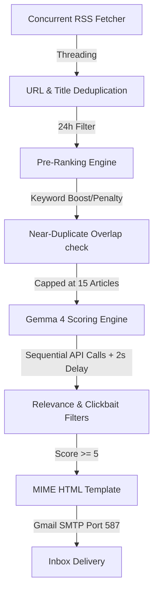

# 🎯 AI Daily News Trend Hunter

An automated daily news assistant that scans tech feeds, scores them using AI, and emails a beautiful, clean summary digest directly to your inbox.

[](https://www.python.org)
[](https://ai.google.dev/)
[](https://github.com/basavarajpatil660/daily-news-hunter/actions)
[](LICENSE)

---

## 💡 How it Works (For Everyone)

You don't need any programming knowledge to understand or use this tool. Here is the simple 3-step process it runs every day:

```text
[1. Fetch News] ───> [2. AI Curation] ───> [3. Email Digest]
Scrapes 11 top tech    Gemma 4 rates articles   Sends the top 5
RSS feeds instantly    and filters out clickbait  stories to your inbox
```

1. **Scrapes the Web:** It automatically grabs the latest articles from Google News, TechCrunch, Wired, The Verge, and more.
2. **Filters with AI:** The **Gemma 4** AI model reads the headlines, rates their importance from 0 to 10, rejects sensationalized clickbait, and writes a short 2-sentence summary.
3. **Sends an Email:** You receive a clean, easy-to-read newsletter with only the highest-quality, most important stories of the day.

---

## 🛡️ Security & Privacy: Is it safe to make this repository public?

**Yes! It is 100% safe to make this repository public.** 

Your sensitive credentials (API keys and passwords) will **never** be leaked or exposed, because:
*   **Ignored Files (`.gitignore`):** Your local configuration file (`.env`) containing your actual API key and email password is automatically ignored by Git. It is kept private on your computer and is never uploaded to GitHub.
*   **Safe Templates:** The repository only contains `.env.example`, which uses blank placeholder values (`your_gmail_address_here`) to show you what variables are needed.
*   **GitHub Secrets:** When running automatically in the cloud, credentials are saved securely in GitHub's encrypted secrets vault, which is hidden from public view.

---

## 🚀 Quick Setup Guide

Follow these steps to set up the daily automation on your GitHub account in less than 5 minutes:

### Step 1: Create a Free Google Gemini API Key
* Go to [Google AI Studio](https://aistudio.google.com/app/apikey).
* Click **Create API Key** and copy it.

### Step 2: Generate a Gmail App Password
* Go to your Google Account's [App Passwords](https://myaccount.google.com/apppasswords) settings.
* Generate a 16-character password specifically for "Mail".

### Step 3: Add Secrets to GitHub
Go to your GitHub repository ➔ **Settings** ➔ **Secrets and variables** ➔ **Actions** ➔ **New repository secret**, and add these **9 secrets**:

*   `GEMINI_API_KEY` - Your Google AI Studio API Key.
*   `GMAIL_USER` - The Gmail address sending the report.
*   `GMAIL_PASS` - The 16-character App Password.
*   `EMAIL_TO` - The email address receiving the newsletter.
*   `NEWS_CATEGORIES` - `AI News,Tech News`
*   `NEWS_REGION` - `IN` (or `US`, `Global`)
*   `NEWS_LANGUAGE` - `en` (or `hi`)
*   `TOP_ARTICLES_COUNT` - `5`
*   `MAX_ARTICLES_TO_SCORE` - `15`

### Step 4: Run a Test
Go to the **Actions** tab in your repository ➔ click **Daily News Hunter** ➔ click **Run workflow**.

---

## 🛠️ Developer Technical Details (Advanced)

If you are a developer looking to customize or understand the codebase, click the sections below to expand:

<details>
<summary><b>📐 Pipeline Architecture</b></summary>


</details>

<details>
<summary><b>📂 Repository Directory Layout</b></summary>

*   `main.py`: Pipeline orchestration, environment validation, and main entry point.
*   `config/categories.py`: Topic keywords, branding color palettes, and RSS feeds config.
*   `services/rss.py`: Multithreaded feed scraper utilizing `python-dateutil` for timezones.
*   `services/gemma.py`: Model initialization with retry validation logic.
*   `services/mail.py`: Gmail SMTP integration and HTML backup writer.
*   `utils/`: Core deduplication, filtering, scoring adjustment, and exponential backoff utility helpers.
</details>

<details>
<summary><b>⚙️ Quota Safety & Resiliency Systems</b></summary>

To prevent API rate limits, the code incorporates:
*   **Quota Caps:** Restricts AI analysis to the top 15 pre-ranked articles per run.
*   **Sequenced Calls:** Processes articles one by one with a mandatory `time.sleep(2)` delay between requests.
*   **Exponential Backoff Retry:** Attempts calls up to 5 times (waiting 5s, 10s, 20s, 40s, 60s) with overrides (60s on 429 quota, 30s on 503/504/timeout/deadline). Exits cleanly with code `0` if model is unavailable.
</details>

---

## 🤝 Contributing

We welcome contributions! Please refer to [CONTRIBUTING.md](CONTRIBUTING.md) for local development setup instructions, branching conventions, and coding style rules.

---

## 🛡️ License

Distributed under the MIT License. See [LICENSE](LICENSE) for more details.

---

<p align="center">
  Powered by <a href="https://www.instagram.com/b.nick.ai/">@b.nick.ai</a>
</p>