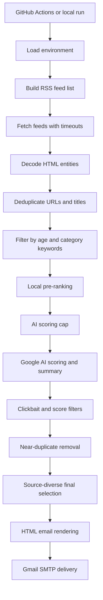

# Daily News Hunter

AI-assisted news curation that turns noisy RSS feeds into a concise daily email briefing.

[](https://github.com/basavarajpatil660/daily-news-hunter/actions)
[](https://www.python.org/)
[](https://ai.google.dev/)
[](LICENSE)

Daily News Hunter fetches technology news, removes duplicates, ranks the best candidates, scores them with a Google AI model, and sends a clean HTML briefing by email. It is designed for low-cost scheduled runs, small API quotas, and human-readable output.

## What It Does

- Collects news from Google News RSS searches and trusted technology feeds.
- Deduplicates exact URLs, duplicate titles, and near-duplicate headlines.
- Filters for recent articles and user-selected categories.
- Pre-ranks stories before AI scoring to reduce wasted API calls.
- Penalizes weak filler such as deals, rumors, Fitbit/app complaints, UI tweaks, and low-impact consumer updates.
- Uses AI to score relevance, summarize articles, detect clickbait, and generate a short insight line.
- Produces a mobile-friendly, image-free email briefing branded with `Powered by @b.nick.ai`.
- Runs manually or on a daily GitHub Actions schedule.

## Current Defaults

| Setting | Default | Purpose |
| --- | ---: | --- |
| `MODEL_NAME` | `models/gemini-2.5-flash` | Active Google AI model. Override this to test another model. |
| `TOP_ARTICLES_COUNT` | `5` | Maximum articles shown in the final email. |
| `MAX_ARTICLES_TO_SCORE` | `1` | Maximum candidates sent to AI by default. Kept low for quota safety. |
| `GEMMA_MAX_ATTEMPTS` | `1` | Attempts per AI-scored article. The name is legacy; it applies to the active model. |
| `GEMMA_RETRY_DELAY_SECONDS` | `2` | Delay between retry attempts when retries are enabled. |
| `GEMMA_REQUEST_TIMEOUT_SECONDS` | `20` | Per-request model timeout. |

The default model is currently Gemini 2.5 Flash because it has been more reliable for this workflow. Gemma 4 can still be tested by setting `MODEL_NAME` to a Gemma model that is available in your Google AI Studio account.

## Architecture



## Repository Layout

```text
daily-news-hunter/
  .github/workflows/daily.yml   Scheduled and manual GitHub Actions workflow
  config/categories.py          News categories, keyword sets, and RSS sources
  reports/email_template.py     HTML email renderer
  services/gemma.py             Google AI model selection, prompting, and response validation
  services/mail.py              Gmail SMTP delivery and backup HTML saving
  services/rss.py               RSS fetching, parsing, and text cleanup
  utils/deduplicate.py          URL, title, and near-duplicate removal
  utils/filter.py               Age, score, clickbait, and keyword filters
  utils/format.py               Time, category color, and relevance label helpers
  utils/retry.py                Bounded retry and quota error handling
  main.py                       Pipeline orchestrator
```

## Scoring Strategy

Daily News Hunter uses two stages to keep quality high and API usage low.

### 1. Local Pre-Ranking

Before calling the model, articles are boosted or penalized using lightweight keyword rules.

Boosted topics include:

- AI models, foundation models, LLMs, Gemini, Claude, Llama
- cybersecurity, breaches, zero-days, ransomware, vulnerabilities
- regulation, lawsuits, antitrust, policy changes
- developer tools, enterprise platforms, funding, acquisitions, research breakthroughs

Penalized topics include:

- deals, discounts, coupons, sales
- rumors, "might", "could"
- app redesigns, UI changes, Fitbit, health app complaints
- low-impact lifestyle or consumer product updates

### 2. AI Editorial Scoring

The model returns structured JSON:

```json
{
  "score": 8,
  "summary": "Two short sentences explaining what happened and why it matters.",
  "importance_reason": "Security risk for developers",
  "clickbait": false
}
```

The final score adds a small source credibility adjustment. The email then prefers strong articles, avoids near duplicates, and limits repeated sources when alternatives exist.

## Quota Safety

The project was built around small free-tier quotas.

- AI scoring is sequential, not parallel.
- `MAX_ARTICLES_TO_SCORE` controls how many candidates can reach the model.
- `GEMMA_MAX_ATTEMPTS` defaults to `1` to avoid repeated failed calls.
- 429/quota errors stop AI scoring immediately.
- RSS fetching uses network timeouts so a bad feed cannot hang the run.
- The GitHub Actions job has a 30-minute timeout.

If you are testing, keep:

```env
MAX_ARTICLES_TO_SCORE=1
GEMMA_MAX_ATTEMPTS=1
MODEL_NAME=models/gemini-2.5-flash
```

After the output is stable and quota has reset, raise `MAX_ARTICLES_TO_SCORE` slowly.

## Setup

### 1. Install dependencies

```bash
pip install -r requirements.txt
```

### 2. Create a local environment file

Copy `.env.example` to `.env`, then fill in your values.

```env
GEMINI_API_KEY=your_google_ai_studio_key
GMAIL_USER=sender@gmail.com
GMAIL_PASS=your_gmail_app_password
EMAIL_TO=recipient@gmail.com
NEWS_CATEGORIES=AI News,Tech News
NEWS_REGION=Global worldwide
NEWS_LANGUAGE=English only
TOP_ARTICLES_COUNT=5
MAX_ARTICLES_TO_SCORE=1
MODEL_NAME=models/gemini-2.5-flash
```

### 3. Run locally

```bash
python main.py
```

## GitHub Actions

The workflow lives at `.github/workflows/daily.yml`.

It runs:

- automatically every day at `00:30 UTC` / `06:00 IST`
- manually through the GitHub Actions `workflow_dispatch` button

Add these repository secrets in GitHub:

| Secret | Required | Notes |
| --- | --- | --- |
| `GEMINI_API_KEY` | Yes | Google AI Studio API key. |
| `GMAIL_USER` | Yes | Gmail account used to send the report. |
| `GMAIL_PASS` | Yes | Gmail app password, not your normal password. |
| `EMAIL_TO` | Yes | Recipient email address. |
| `NEWS_CATEGORIES` | Yes | Example: `AI News,Tech News`. |
| `NEWS_REGION` | Yes | Example: `Global worldwide`, `USA only`, or India-focused default. |
| `NEWS_LANGUAGE` | Yes | Example: `English only` or `English and Hindi both`. |
| `TOP_ARTICLES_COUNT` | Optional | Defaults to `5`. |
| `MODEL_NAME` | Optional | Defaults to `models/gemini-2.5-flash`. |
| `MAX_ARTICLES_TO_SCORE` | Optional | Defaults to `1`. |
| `GEMMA_MAX_ATTEMPTS` | Optional | Defaults to `1`. Legacy name; applies to the active model. |
| `GEMMA_RETRY_DELAY_SECONDS` | Optional | Defaults to `2`. |
| `GEMMA_REQUEST_TIMEOUT_SECONDS` | Optional | Defaults to `20`. |

## Model Selection

The active model is controlled by `MODEL_NAME`.

Recommended working default:

```env
MODEL_NAME=models/gemini-2.5-flash
```

Manual Gemma 4 testing, only if your account has quota and access:

```env
MODEL_NAME=models/gemma-4-31b-it
```

If a model repeatedly returns quota errors or fails to produce valid JSON, reduce `MAX_ARTICLES_TO_SCORE` and `GEMMA_MAX_ATTEMPTS` before testing again.

## Email Output

The email is intentionally simple and email-client-safe:

- no images
- no thumbnail placeholders
- no raw scores
- no `Top Pick` label
- concise category/source/time metadata
- two-sentence article summaries
- short `Insight` line
- subtle `Powered by @b.nick.ai` footer

## Troubleshooting

### `429 quota exceeded`

Your Google AI free-tier quota for the selected model is exhausted. Wait for the daily reset, then test with:

```env
MAX_ARTICLES_TO_SCORE=1
GEMMA_MAX_ATTEMPTS=1
```

### Empty or no-results email

This usually means every scored article failed, was clickbait, or scored below the final quality threshold. Increase `MAX_ARTICLES_TO_SCORE` slowly after quota reset.

### GitHub Actions keeps running

The workflow has a 30-minute timeout. If it still appears stuck, check whether GitHub is waiting for a runner or whether an external service is slow.

### Gmail authentication fails

Use a Gmail app password. A normal Gmail password will not work for SMTP.

### Broken article text like `Here&#8217;s`

RSS text is decoded with Python's `html.unescape`. If a feed still renders broken text, check the raw feed content and add cleanup near `services/rss.py`.

## Security

This repo is safe to keep public when credentials stay in `.env` locally and GitHub Actions secrets remotely.

Never commit:

- `.env`
- Gmail app passwords
- Google AI API keys
- exported email logs containing private addresses

## License

MIT. See [LICENSE](LICENSE).

## Brand

Powered by [@b.nick.ai](https://www.instagram.com/b.nick.ai/).
