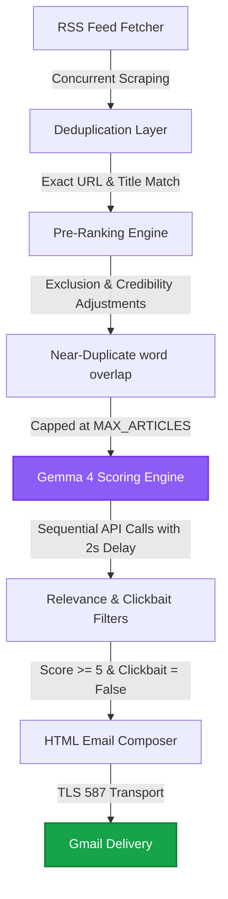

# 🎯 AI Daily News Trend Hunter

[](https://www.python.org)
[-purple.svg?logo=google&logoColor=white)](https://ai.google.dev/)
[](https://github.com/basavarajpatil660/daily-news-hunter/actions)
[](LICENSE)
[](https://www.instagram.com/b.nick.ai)

An automated, intelligent, and quota-safe news ingestion and curation pipeline. **AI Daily News Trend Hunter** fetches, filters, scores, and delivers high-relevance tech and science briefings directly to your inbox daily. Powered strictly by **Gemma 4** (`gemma-4-31b-it`) and built entirely in Python.

---

## 🗺️ Architectural Workflow



---

## ⚡ Key Features

*   **100% Free RSS News Ingestion**: Fetches fresh global & regional articles concurrently using Python threads (10-second timeout, 3 retries).
*   **Precision Pre-Ranking**: Sorts and filters articles before AI scoring to protect your API quota. Boosts key releases/vulnerabilities (+2) and penalizes noise/deals (-2).
*   **Gemma 4 Powerhouse**: Uses the state-of-the-art `gemma-4-31b-it` model exclusively for relevance scoring (0-10), Clickbait detection, and generating concise, 2-sentence English summaries.
*   **Resilient API Handling**: Implements exponential backoff retry logic (5 attempts, up to 60s) with error-specific overrides (429/quota, 503/504/timeout/deadline). Includes a clean exit (`sys.exit(0)`) on 404 model unavailability.
*   **Gmail-Optimized Delivery**: Compiles beautifully formatted HTML digests with mobile-responsive single-column layouts, inline styling, and relevance badges ("Important" badge for scores >= 9.0). Saves local HTML backups if dispatch fails.
*   **GitHub Actions Automation**: Pre-configured CI/CD workflow running daily at 6:00 AM IST (00:30 UTC) with a 30-minute safety timeout.

---

## 📁 Repository Structure

```text
daily-news-hunter/
├── .github/workflows/
│   └── daily.yml          # GitHub Actions workflow (daily schedule & dispatch)
├── config/
│   ├── __init__.py
│   └── categories.py      # Category definitions, keywords, colors, & URL builders
├── services/
│   ├── __init__.py
│   ├── rss.py             # Concurrent feed parser with python-dateutil
│   ├── gemma.py           # Gemma 4 initialization & scoring execution
│   └── mail.py            # Gmail SMTP transport with backup mechanism
├── utils/
│   ├── __init__.py
│   ├── retry.py           # Exponential backoff & override wrapper
│   ├── scoring.py         # Credibility & pre-rank scoring rules
│   ├── deduplicate.py     # URL, title, & near-duplicate token deduplicator
│   ├── filter.py          # Clickbait, minimum score, and keyword filtering
│   └── format.py          # Human-readable date-times and badge formatters
├── reports/
│   ├── __init__.py
│   └── email_template.py  # Gmail-compliant HTML newsletter generator
├── .env.example           # Local environment configuration template
├── .gitignore             # Git exclusion rules
├── requirements.txt       # Hardpinned Python dependencies
└── main.py                # Main pipeline coordinator & environment validator
```

---

## 🛠️ Local Installation

### Prerequisites
*   Python 3.11 or higher
*   Google AI Studio API Key ([Get it for free](https://aistudio.google.com/app/apikey))
*   Gmail account and an [App Password](https://myaccount.google.com/apppasswords)

### Step-by-Step Setup

1.  **Clone the Repository**
    ```bash
    git clone https://github.com/basavarajpatil660/daily-news-hunter.git
    cd daily-news-hunter
    ```

2.  **Install Dependencies**
    ```bash
    pip install -r requirements.txt
    ```

3.  **Configure Environment Variables**
    Copy `.env.example` to `.env` and fill in your credentials:
    ```bash
    cp .env.example .env
    ```
    Edit the `.env` file:
    ```env
    GEMINI_API_KEY=your_google_ai_studio_key_here
    GMAIL_USER=your_gmail_address_here
    GMAIL_PASS=your_gmail_app_password_here
    EMAIL_TO=recipient_email_here
    NEWS_CATEGORIES=AI News,Tech News
    NEWS_REGION=IN
    NEWS_LANGUAGE=en
    TOP_ARTICLES_COUNT=5
    MAX_ARTICLES_TO_SCORE=15
    ```

4.  **Run Locally**
    ```bash
    python main.py
    ```

---

## 🚀 Production Deployment via GitHub Actions

To run this pipeline automatically on a daily schedule, deploy it using the pre-configured GitHub Actions workflow:

### Add GitHub Secrets
Navigate to your GitHub repository -> **Settings** -> **Secrets and variables** -> **Actions** and add the following 9 secrets:

| Secret Name | Description | Example Value |
| :--- | :--- | :--- |
| `GEMINI_API_KEY` | Google AI Studio Key | `AIzaSy...` |
| `GMAIL_USER` | Sending Gmail account | `sender@gmail.com` |
| `GMAIL_PASS` | 16-character App Password | `abcd efgh ijkl mnop` |
| `EMAIL_TO` | Receiving email account | `recipient@gmail.com` |
| `NEWS_CATEGORIES` | Comma-separated categories | `AI News,Tech News` |
| `NEWS_REGION` | Regional filter code | `IN`, `US`, or `Global` |
| `NEWS_LANGUAGE` | Language filter code | `en` or `hi` |
| `TOP_ARTICLES_COUNT` | Max articles in the email | `5` |
| `MAX_ARTICLES_TO_SCORE`| Quota-safety scoring cap | `15` |

---

## 📈 Supported News Categories & Visual Badges

Briefings are categorised and styled with distinct color palettes:

*   💜 **AI News** (`#7c3aed`)
*   💙 **Tech News** (`#2563eb`)
*   💙 **AI App Building** (`#4338ca`)
*   ❤️ **Cybersecurity** (`#dc2626`)
*   🧡 **Startup and Entrepreneur** (`#ea580c`)
*   💚 **Science and Research** (`#16a34a`)
*   🖤 **Space and Astronomy** (`#1e3a5f`)
*   💛 **Finance and Economy** (`#ca8a04`)
*   💚 **Health and Medical Tech** (`#0d9488`)

---

## 🛡️ License

This project is licensed under the MIT License - see the [LICENSE](LICENSE) file for details.

---

<p align="center">
  Powered by <a href="https://www.instagram.com/b.nick.ai/">@b.nick.ai</a>
</p>